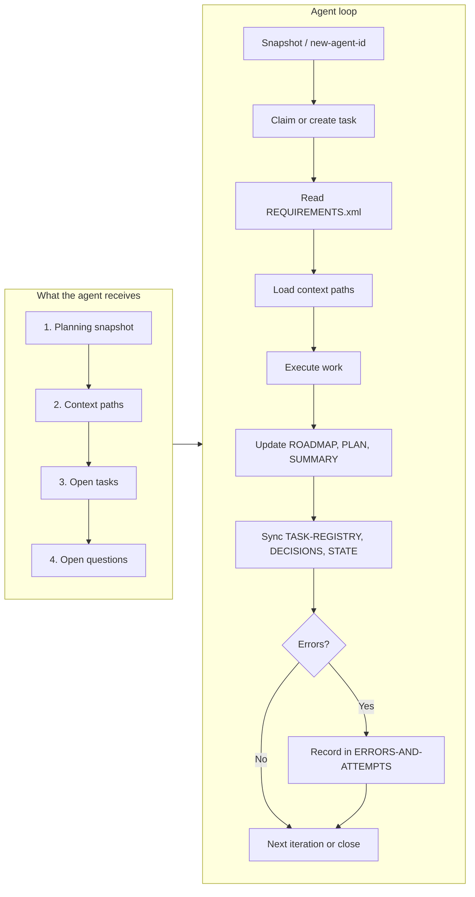
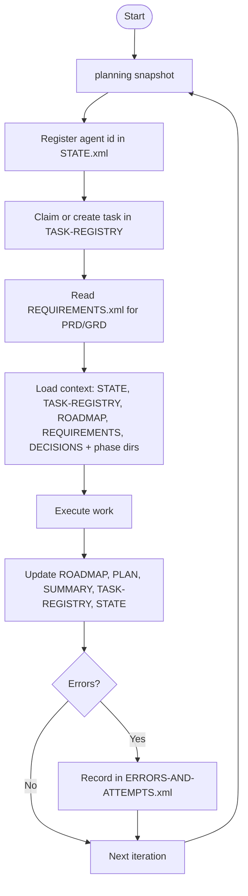

══════════════════════════════════════════════════════════════
  AGENT LOOP REPORT
══════════════════════════════════════════════════════════════

**Generated:** 2026-03-20T22:51:30.324Z  
**Format:** planning-agent-context/1.0

<details>
<summary><strong>KPIs — token usage, context per sprint phase</strong></summary>

Same as CLI: <code>planning kpis</code>

```text
PRD / REQUIREMENTS.xml
Total chars: 570 · tokens ≈ 143

Sprint 0 (phases: 01)
Task count: 1 · task-text tokens ≈ 22
Context tokens per phase (phase dirs):

01 (01-foundation): ≈ 584 tokens (2335 chars)

Sprint total (phase dirs + task text): ≈ 606 tokens
```
</details>

<details>
<summary><strong>What is an agent’s workflow? (summary)</strong></summary>

1. **Snapshot** → `planning snapshot` (or `new-agent-id`) shows current phase, plan, agents, open tasks, phase progress.
2. **Get an ID** → `planning new-agent-id` prints a new id on one line (e.g. `agent-20250303-abcd`). The agent registers it in STATE.xml under `agent-registry`.
3. **Claim work** → Claim or create a task in TASK-REGISTRY.xml (phase, goal, commands).
4. **Read context** → When using the CLI (`planning simulate loop`), the bundle **serves** STATE, TASK-REGISTRY, ROADMAP, DECISIONS, and sprint phase dirs (and **always serves coding conventions**, e.g. AGENTS.md). The agent is also directed to **code file references** (from task commands + config) for implementation context.
5. **Execute** → Do the task; update ROADMAP, phase PLAN/SUMMARY; sync TASK-REGISTRY, DECISIONS, STATE.
6. **Errors** → Record in ERRORS-AND-ATTEMPTS.xml if needed.

**Outputs / references:** STATE.xml, TASK-REGISTRY.xml, ROADMAP.xml, REQUIREMENTS.xml, DECISIONS.xml, `.planning/phases/<phase>/` (PLAN.xml, SUMMARY.xml), `.planning/reports/` (this report).
</details>

<details>
<summary><strong>System health — track &amp; analyze</strong></summary>

Current snapshot (also in <code>.planning/reports/metrics.jsonl</code>; one line per <code>planning report generate</code>). Use <code>planning metrics</code> / <code>planning metrics-history --n 30</code> or fetch <code>http://localhost:3847/metrics?tail=50</code> when report server is running.

| Metric | Value |
|--------|-------|
| At | 2026-03-20T22:51:30.327Z |
| Tasks | 0 / 1 (0% done) |
| Open questions | 0 |
| Active agents | 0 |
| Phases (with tasks / total / complete) | 1 / 1 / 0 |
| Errors/attempts (ERRORS-AND-ATTEMPTS.xml) | 0 |
| Review (phases at 0% / unassigned / only planned) | 1 / 1 / 1 |
| Snapshot tokens (approx) | 61 |
| Bundle tokens (simulate loop, approx) | 1542 |
</details>

<details>
<summary><strong>THINGS TO REVIEW</strong></summary>

Same as CLI: <code>planning review</code>

```text
Phases at 0% progress (e.g. 46: 0/1, 49: 0/1) or unassigned tasks may be skipped or abandoned. Use planning review to list them; planning review --json to output data for tools or APIs.

Phases at 0% (skipped/abandoned?)

Phase	Title	Tasks	Suggestion
01	Foundation	01-01	Phase may be skipped or abandoned; consider assigning work or closing/superseding tasks.

Unassigned tasks (agent-## or empty)

Task	Phase	Status	Suggestion
01-01	01	planned	Task has no real agent assigned; assign or use agent-## as placeholder until claimed.

Phases with only planned work (no in-progress)

Phase	Title	Tasks	Suggestion
01	Foundation	01-01	No task in progress; may need prioritization or an agent to claim work.
```
</details>


──────────────────────────────────────────────────────────────
  AGENT ID: what the agent sees (verbatim)
──────────────────────────────────────────────────────────────

When an agent runs **`planning new-agent-id`**, it receives exactly the following. (First: full snapshot. Then: one line with the new id.)

**1. Snapshot (exact stdout):**

```text
STATE (.planning/STATE.xml)
agents (active):
  (none)

OPEN TASKS (.planning/TASK-REGISTRY.xml)

PHASE
  Progress (.planning/TASK-REGISTRY.xml)
  DEPS (tree, id title [status]) (.planning/ROADMAP.xml) — file context
    01 Foundation [active]
```

**2. Then one line (exact stdout):**

```text
Your new agent id: agent-20260320-repr
```

The agent adds the printed id to STATE.xml under `agent-registry` (and optionally sets phase, plan, status). **Who’s working** = agents that have claimed an id (listed in STATE.xml). Below: count and list of those agents and the **context** (task goals, phase titles) they see.


──────────────────────────────────────────────────────────────
  AGENTS IN THE REPO (0 with claimed IDs)
──────────────────────────────────────────────────────────────


No agents have claimed IDs yet. After `planning new-agent-id`, register the printed id in STATE.xml to appear here.


──────────────────────────────────────────────────────────────
  WHAT THE AGENT SEES (literal inputs in workflow order)
──────────────────────────────────────────────────────────────

Exact CLI/bundle output the agent receives; each input is in a code block below.

**Current (focal):** STATE has a single **current-phase** and **current-plan** — the repo’s chosen focus (e.g. phase 50, plan 50-09). That is “who is current” at the repo level. **Phases with in-progress work** can be several: any phase that has an agent with status `in-progress` or a task with status `in-progress`. Right now: —.

**1. SNAPSHOT (exact stdout of planning snapshot / new-agent-id)**

```text
STATE (.planning/STATE.xml)
agents (active):
  (none)

OPEN TASKS (.planning/TASK-REGISTRY.xml)

PHASE
  Progress (.planning/TASK-REGISTRY.xml)
  DEPS (tree, id title [status]) (.planning/ROADMAP.xml) — file context
    01 Foundation [active]
```

**2. NEW AGENT ID LINE (exact stdout when running planning new-agent-id)**

```text
Your new agent id: agent-20260320-repr
```

**3. CONTEXT PATHS (exact list from bundle, one per line)**

```text
.planning\STATE.xml
.planning\TASK-REGISTRY.xml
.planning\ROADMAP.xml
.planning\REQUIREMENTS.xml
.planning\DECISIONS.xml
.planning\phases\01-foundation
```

*In bundle:* conventions none · code refs none

**4. OPEN TASKS (exact format from snapshot/bundle)**

```text

- 01-01 [planned] Establish Grime Time site structure, content model, and deployment. (agent: )


```

**5. OPEN QUESTIONS (exact format from bundle)**

```text

No open questions.

```


──────────────────────────────────────────────────────────────
  AGENT LOOP WORKFLOW (Mermaid)
──────────────────────────────────────────────────────────────






──────────────────────────────────────────────────────────────
  1. SNAPSHOT
──────────────────────────────────────────────────────────────

| Field | Value |
|-------|--------|
| Current phase | 1 |
| Current plan | 01-01 |
| Status | in-progress |

**Next action:** Expand PRD in REQUIREMENTS.xml and scaffold the site.

### Agents


No agents registered.


──────────────────────────────────────────────────────────────
  2. CONTEXT (Sprint 0) — Paths the agent loads
──────────────────────────────────────────────────────────────

**Phase IDs in sprint:** 01  
**Task count in sprint:** 1

#### Phases in sprint


- **01** Foundation — in-progress


#### Exact paths (literal list given to the AI)


- `.planning\STATE.xml`

- `.planning\TASK-REGISTRY.xml`

- `.planning\ROADMAP.xml`

- `.planning\REQUIREMENTS.xml`

- `.planning\DECISIONS.xml`

- `.planning\phases\01-foundation`


──────────────────────────────────────────────────────────────
  3. OPEN TASKS
──────────────────────────────────────────────────────────────


| Id | Status | Agent | Goal |
|----|--------|-------|------|
| 01-01 | planned |  | Establish Grime Time site structure, content model, and deployment. |


──────────────────────────────────────────────────────────────
  4. OPEN QUESTIONS
──────────────────────────────────────────────────────────────


No open questions.


══════════════════════════════════════════════════════════════
